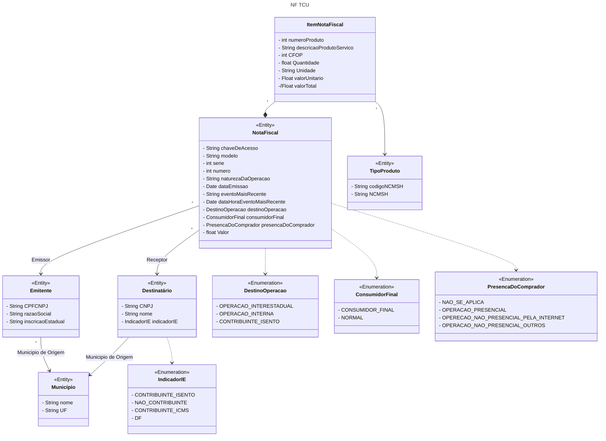

# Agentes de Notas Fiscais

O projeto fornece um agente que responde às perguntas referentes aos dados de 100 notas fiscais selecionadas aleatoriamente do arquivo de notas fiscais do mês de janeiro/2024, disponibilizado pelo Tribunal de Contas da União.

## Objetivo

A atividade tem por objetivo criar um ou mais agentes que tornem possível a um usuário realizar perguntas sobre os arquivos CSV disponibilizados.

Por exemplo: Qual é o fornecedor que teve maior montante recebido? Qual item teve maior volume entregue (em quantidade)? E assim por diante.


## Arquitetura Básica do Sistema

O projeto utiliza o [N8N](https://n8n.io/) como espinha dorsal e fluxo principal responsável por executar o agente que respondera às nossas perguntas sobre as notas fiscais e como fluxo auxiliar de ETF (*Extract, Transform and Load*) dos dados das notas fiscais que estão comprimidos em dois arquivos em formato CSV dentro de um arquivo zipado e que alimentarão o banco de dados *[Postgre SQL](https://www.postgresql.org/)*.

A idéia por trás é que, uma vez o banco de dados esteja preenchido com os dados das Notas Fiscais, seja possível executar consultas SQL a partir da tradução de uma pergunta de interesse do usuário via *prompt*, obter o resultado da consulta, traduzir novamente para língua portuguesa e exibir a resposta para o usuário. Este é o *core* da aplicação.

Desta forma o agente utiliza dois modelos LLMs: um modelo responsável pela tradução da pergunta do usuário para SQL e outro modelo responsável por traduzir a resposta da consulta SQL para a língua portuguesa.

E para rodar esses modelos localmente, utilizaremos o [Ollama](https://ollama.com/)  que é uma  ferramenta de código aberto que permite executar modelos de linguagem grandes (LLMs) localmente em seu computador. Ele simplifica o processo de baixar, executar e gerenciar LLMs, eliminando a necessidade de lidar com configurações complexas e dependências em nuvem.

A execução do *script* *docker-compose* via Docker baixará todas as ferramentas e dependências citadas acima, instalará e inicializará automaticamente o N8N, PostgreSQL e o Ollama para você.


## Instalação

A idéia primária é rodar nosso projeto na máquina local utilizando primariamente ferramentas open-source visando minimizar custos.

A abaixo, seguem as ferramentas mínimas que deverão ser instaladas localmente:

### Docker

Devemos primeiramente instalar em nossa máquina local, o [Docker](https://www.docker.com/).

O Docker  é uma plataforma de código aberto que automatiza a implantação, execução e gerenciamento de aplicações em *contêineres*. Contêineres são unidades de software padronizadas que contêm tudo o que uma aplicação precisa para ser executada, incluindo código, bibliotecas e dependências. O Docker permite que você crie, implante e escale aplicações de forma rápida e consistente em qualquer ambiente.

Com o Docker instalado em sua máquina, basta rodar um *script * que ele entende (o *docker-compose*) que ele instalará e inicializará todas as ferramentas necessários para rodar nosso agente (n8n, PostgreSQL, Ollama e modelos LLM).

Para maiores detalhes sobre como instalar o Docker para o Windows , acesse [aqui](https://www.simplilearn.com/tutorials/docker-tutorial/install-docker-on-windows).

Para maiores detalhes sobre como instalar o Docker para o Linux, acesse [aqui](https://docs.docker.com/desktop/setup/install/linux/).

Para maiores detalhes sobre como instalar o Docker para Mac, acesse [aqui](https://docs.docker.com/desktop/setup/install/mac-install/).


### Ferramenta de Descompatação de Arquivos

Você pode baixar o código fonte comprimido em um arquivo em formato zip diretamente do [Github do Projeto agente-nf-tcu da Sinapse.7](https://github.com/synapsesete/agente-nf-tcu/archive/refs/heads/main.zip). 

Descompacte o seu arquivo em sua máquina local utilizando o [Winzip](https://www.winzip.com/), por exemplo.
 

### Cliente do Github (Opcional)

Se você quiser, você pode baixar diretamente o código fonte do projeto em sua máquina local. Para isso, devemos instalar antes o Github para clientes. 

Para instalar em seu sistema operacional, acesse [aqui](https://docs.github.com/en/desktop/installing-and-authenticating-to-github-desktop/installing-github-desktop).


## Rodando localmente

Clone o projeto

```bash
  git clone https://github.com/synapsesete/agente-nf-tcu
```

Ou descompacte o arquivo contendo o código fonte diretamente [daqui](https://github.com/synapsesete/agente-nf-tcu/archive/refs/heads/main.zip).


Entre no diretório do projeto

```bash
  cd agente-nf-tcu
```

Execute o seguinte comando (Windows)

```bash
  run.bat
```

Execute o seguinte comando (Linux)

```bash
  ./run.sh
```

Aguarde o docker baixar e instalar as dependências, modelos de LLMs, etc.
 Quando o projeto estiver pronto e rodando localmente na sua máquina, ele informará que é possível acessar o editor do n8n através do endereço [http://localhost:5678](http://localhost:5678).

Finalmente, acesse o chat local para fazer suas perguntas através do endereço abaixo:

[http://localhost:5678/webhook/a7bce04c-12f8-4683-80e0-cb4229166d60/chat](http://localhost:5678/webhook/a7bce04c-12f8-4683-80e0-cb4229166d60/chat)
## Modelagem

