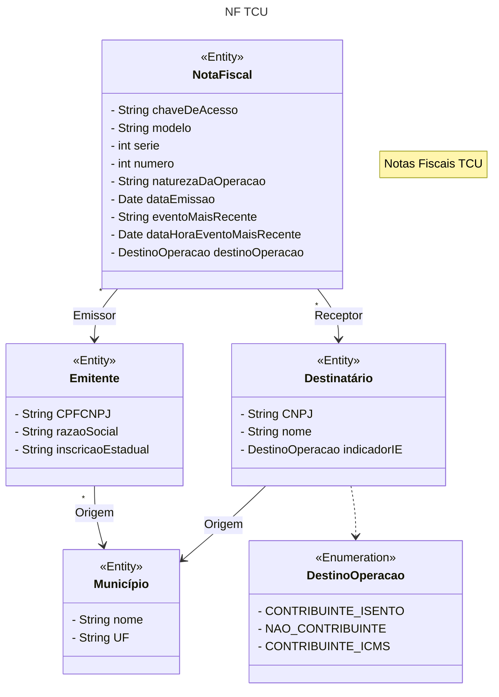

# Agentes de Notas Fiscais

O projeto fornece um agente que responde às perguntas referentes aos dados de 100 notas fiscais selecionadas aleatoriamente do arquivo de notas fiscais do mês de janeiro/2024, disponibilizado pelo Tribunal de Contas da União.

## Objetivo

A atividade tem por objetivo criar um ou mais agentes que tornem possível a um usuário realizar perguntas sobre os arquivos CSV disponibilizados.

Por exemplo: Qual é o fornecedor que teve maior montante recebido? Qual item teve maior volume entregue (em quantidade)? E assim por diante.

## Modelagem

